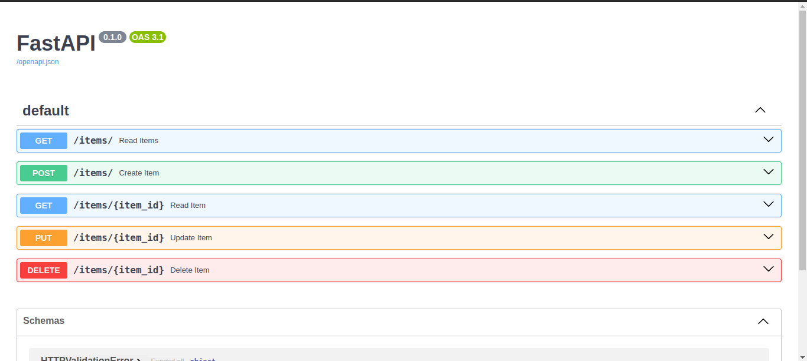

# README

## Description
This repository contains images for various purposes.

## Usage
Feel free to use the images in this repository for your projects. Simply click on an image to view it, and then right-click and select "Save Image As" to download it.

  

## Contributing
If you have any images that you would like to contribute to this repository, please follow these steps:
1. Fork this repository.
2. Add your image to the appropriate folder.
3. Create a pull request with a brief description of your image.

## License
This repository is licensed under the [MIT License](LICENSE).

